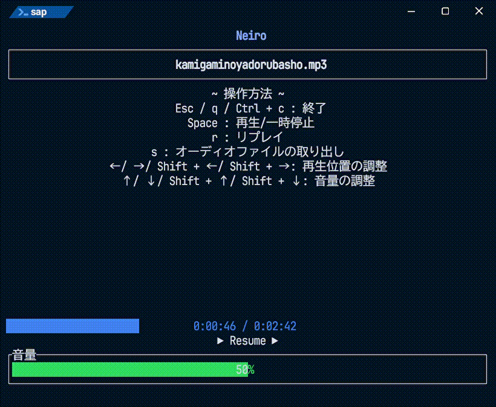

# <span style="color:#A0ffff">Neiro （ねゐろ）</span>
[日本語](README.md)・[英語](./README/README-en.md)
```batch
.\sap.exe
```
(*'▽')＜ターミナル上で動作するシンプルなオーディオプレイヤーです。



## ❄概要❄
- ターミナル上で動作するシンプルなオーディオプレイヤー
- コマンドによる再生、TUIによる操作

## 💻実行環境💻
- [x] Windows 11

## ⬇インストール⬇

### バイナリ
- Windows : [sap.exe](https://github.com/c0b23092db/neiro/releases/download/0.2.0/sap-v0.2.0-x86_64-pc-windows-msvc.zip)

### cargo
```batch
cargo install --locked --git https://github.com/c0b23092db/neiro
```

## 🎼使用方法🎶
```
Simple Audio File Player in Terminal

Usage: sap.exe [オプション] <ファイル名>

Arguments:
  <ファイル名>   オーディオファイルのパス

オプション:
  -t, --timer <TIMER>    再生時間を指定する (0: 最後まで再生する) [デフォルト: 0]
  -v, --volume <VOLUME>  曲の音量を指定する [0-100] [デフォルト:50]
  -i, --interactive  インタラクティブモードで起動する。
  -h, --help         ヘルプを表示する。
  -V, --version      バージョンを表示する。
```

### 同期再生モード
```batch
> sap.exe audio.mp3
.\audio.mp3 | 2:42 | 2:42
```
コマンドラインで実行するモードです。  
再生を停止するときは`Ctrl + C`を使用してください。  
オプションと書かれている引数は`-v`や`-h`などを追加して使用します。  

- Timer（オプション）
  　曲の再生時間を指定する。
  　**0で曲を最後まで再生する。**
```batch
> sap.exe audio.mp3 -t 10
.\audio.mp3 | 2:42 | 0:10
```

- Volume（オプション）
  　曲の音量を指定する。
```batch
> sap.exe audio.mp3 -t 5 -v 10
.\audio.mp3 | 2:42 | 0:05
```

### インタラクティブモード
```batch
sap -i audio.mp3
```
TUI上で再生するモードです。  
受け付けるオプションはvolumeのみです。

- Volume（オプション）
  　曲の音量を指定する。
```batch
> sap.exe -i audio.mp3 -v 10
```

#### TUIの操作
- Esc / q / Ctrl + c
  終了
- スペースキー
  再開 / 一時停止
- r
  リプレイ
- s
  オーディオファイルの取り出し
- ↑ ↓
  音量の変更。Shift同時押しで大きく変更。
- ← →
  再生位置の変更。Shift同時押しで大きく変更。

### ~~非同期再生モード~~
この機能は**未実装**です。
```batch
sap -a audio.mp3
sap pause
sap resume
sap stop
```

## 実装予定
- [x] 同期再生モード
- [x] インタラクティブモード
- [ ] 非同期再生モード

## 🔍開発者🔎
- いかた゚ ： [](url)

## ♪開発に使用した音源♪
- [Amethyst break1](https://minecraft.fandom.com/wiki/Category:Amethyst_sounds)
- [神々の宿る場所](https://amachamusic.chagasi.com/music_kamigaminoyadorubasho.html)
- [4小節ごとにジャンルが変わるUnwelcome School.Remix](https://booth.pm/ja/items/6307718)

## 📄ライセンス📝
[MIT Licence](./LICENSE.md) / <http://opensource.org/licenses/MIT>
